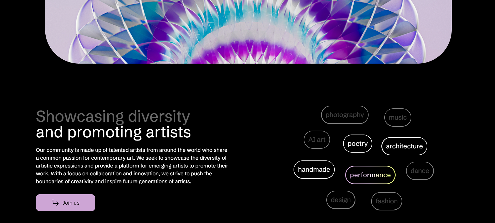
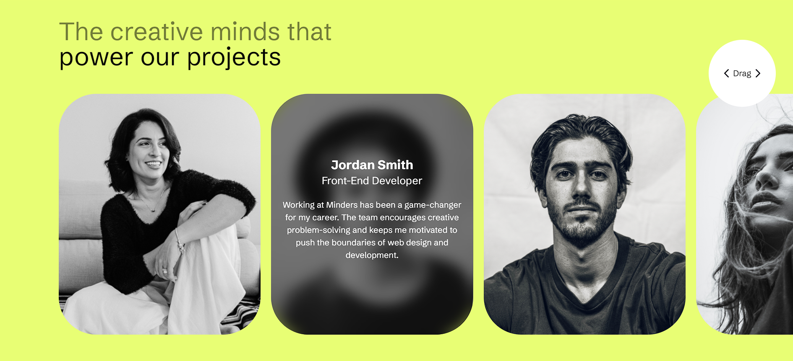
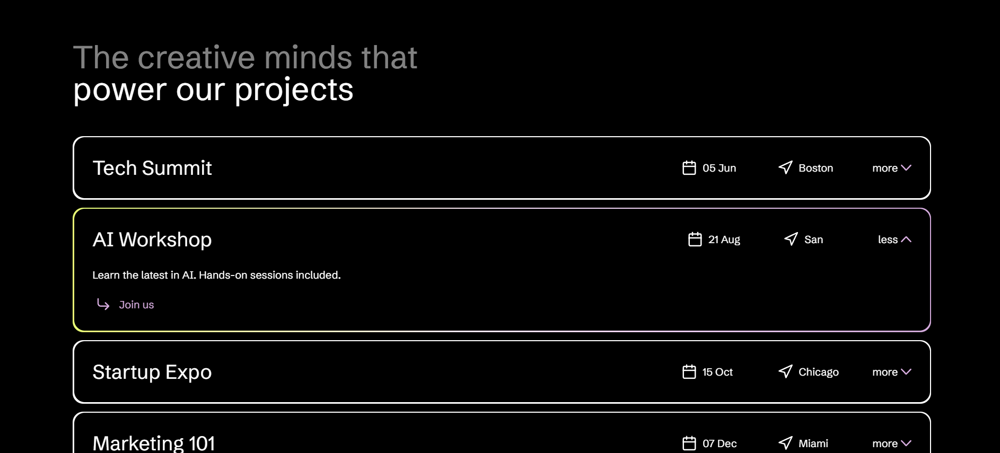

<h1>Minders - Creative Community Platform</h1>

  
  
  
  

Minders is a modern, responsive web application built with React, showcasing a platform for creative artists and professionals. This frontend-only project demonstrates a sleek design and interactive user interface for a community-focused art and creativity platform.

<h2>✨ Features</h2>
<ul>
  <li><strong>Responsive Design</strong> using Tailwind CSS</li>
  <li><strong>Interactive Components</strong> like carousel and accordion</li>
  <li><strong>Custom Routing</strong> with React Router</li>
  <li><strong>Gradient Text and Button Effects</strong></li>
  <li><strong>Smooth Sliding</strong> with Swiper.js integration</li>
</ul>

<h2>🎨 Preview</h2>

  
  
  

<h2>🚀 Prerequisites</h2>

Ensure you have the following tools:

<ul>
  <li> Node.js (v14.0.0 or later)</li>
  <li> npm (v6.0.0 or later)</li>
</ul>

<h2>📥 Installation</h2>
<ol>
  <li>Clone the repository:
    <pre><code>git clone https://github.com/your-username/minders.git</code></pre>
  </li>
  <li>Navigate to the project directory:
    <pre><code>cd minders</code></pre>
  </li>
  <li>Install the dependencies:
    <pre><code>npm install</code></pre>
  </li>
  <li>Start the development server:
    <pre><code>npm start</code></pre>
    
This will start the application on <code>http://localhost:3000</code>.

  </li>
  <li>Create a production build:
    <pre><code>npm run build</code></pre>
  </li>
</ol>

<h2>📂 Project Structure</h2>
<ul>
  <li><code>/src</code>: Source code</li>
  <li><code>/components</code>: Reusable React components</li>
  <li><code>/pages</code>: Page components</li>
  <li><code>/routes</code>: Routing configuration</li>
  <li><code>/public</code>: Static assets and HTML template</li>
</ul>

<h2>🛠 Technologies Used</h2>
<ul>
  <li><strong>React.js</strong></li>
  <li><strong>React Router</strong></li>
  <li><strong>Tailwind CSS</strong></li>
  <li><strong>Swiper.js</strong></li>
</ul>

<h2>🤝 Contributing</h2>

We welcome contributions! Please check the <a href="https://github.com/your-username/minders/issues">issues page</a> for open issues and feature requests.

<h2>📜 License</h2>

This project is open source and available under the <a href="LICENSE">MIT License</a>.

